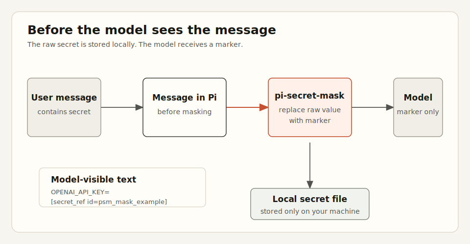
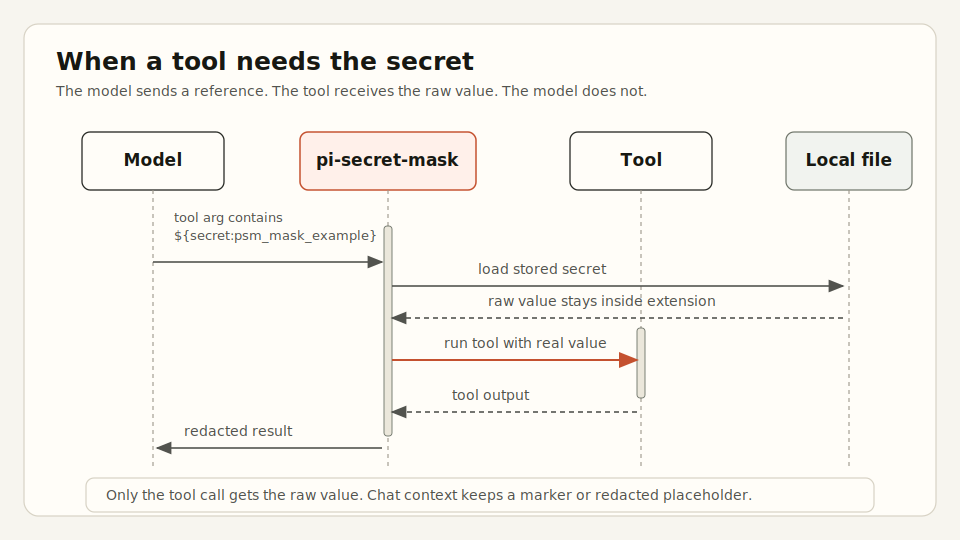

# pi-secret-mask

English: [README.md](README.md)

`pi-secret-mask` 是一个 Pi extension, 会在 secret 发送给 LLM 前遮蔽它. 在模型可见的文本里, secret 会被替换成类似 `[secret_ref id=psm_mask_example ...]` 的 marker. 如果模型之后把 `${secret:psm_mask_example}` 传给工具, 插件只会在这次工具调用边界恢复真实值.

## 安装

前提: 本机已经安装 Pi, 并且可以运行 `pi` 命令.

从 GitHub 安装:

```bash
pi install https://github.com/NolanHo/pi-secret-mask
```

不永久安装, 只在本次 Pi 运行中加载 extension:

```bash
pi -e https://github.com/NolanHo/pi-secret-mask
```

从本地 clone 安装:

```bash
cd /path/to/pi-secret-mask
pi install .
```

在 Pi 会话内使用:

```text
/secret-mask status
/secret-mask on
/secret-mask off
```

Masking 默认启用.

## 工作方式

这里有两个独立步骤: 先在模型看到上下文前 mask, 然后只在工具需要 secret 时临时恢复.

### 1. 模型看到消息之前



### 2. 工具需要 secret 时



## 行为

启用后, 插件会遮蔽它能控制的、会发给模型的文本:

1. 发给模型的聊天上下文.
2. 最终 provider request, 作为最后一层扫描.
3. compaction 生成的对话总结.
4. branch summary.
5. 使用 `${secret:<id>}` reference 的工具参数.
6. 成功的工具输出, 其中被注入过的 secret 会再次被 redact.

遮蔽后的值类似这样:

```text
OPENAI_API_KEY=[secret_ref id=psm_mask_example label=secret chars=51. Use ${secret:psm_mask_example} in tool arguments to use this secret without reading it.]
```

模型可以把 reference 传给工具来使用 secret:

```json
{
  "command": "curl -H 'Authorization: Bearer ${secret:psm_mask_example}' https://api.example.com/me"
}
```

这个 extension 不提供把已存储 secret 打印回聊天窗口的命令或工具. 为了支持后续工具调用, 原始 secret 会保存在 Pi 数据目录下的本地磁盘中.

## Artifact 存储

Secret 保存在:

```text
~/.pi/agent/pi-secret-mask/<session-id>/psm_mask_<hash>.json
```

文件用 `0600` 权限写入.

## Compaction 和 tree summary

Pi 可能会总结较早的对话轮次和 branch history. 这个 extension 也会尝试在这些总结里遮蔽 secret. 如果总结内容包含匹配到的 secret, 但 extension 无法生成 masked summary, 它会阻止这次总结, 而不是让 raw secret 进入总结.

这个保护从 extension 加载后开始生效. 安装 extension 之前已经写入旧 summary 的 secret 不在保护范围内.

## 匹配规则

插件匹配以下模式.

| 规则 | 匹配内容 | 示例 |
|---|---|---|
| `private-key-block` | 从 `BEGIN ... PRIVATE KEY` 到 `END ... PRIVATE KEY` 的 PEM private key block | RSA, EC, OpenSSH-style private key PEM blocks |
| `auth-header-token` | `Bearer`, `Basic`, `Token` 凭证, 前面可以带 `Authorization:` 或 `Authorization=` | `Authorization: Bearer eyJ...`, `Token abcdef...` |
| `sensitive-query-param` | URL query 参数: `access_token`, `refresh_token`, `id_token`, `client_secret`, `code`, `code_verifier`, `code_challenge`, `state`, `nonce` | `?access_token=abc123...&client_secret=def456...` |
| `secret-assignment` | key 名包含 `API_KEY`, `TOKEN`, `SECRET`, `PASSWORD`, `PASSWD`, `PRIVATE_KEY`, `CLIENT_SECRET`, `AUTH` 的赋值 | `OPENAI_API_KEY=sk-...`, `password: my-secret-password` |
| `json-secret-field` | quoted JSON-like 字段: `api_key`, `access_token`, `refresh_token`, `id_token`, `secret`, `password`, `private_key`, `client_secret`, `authorization` | `"api_key": "sk-..."`, `'password': '...'` |
| `known-token-prefix` | 常见 token prefix | `sk-`, `sk-ant-`, `sk-proj-`, `ghp_`, `github_pat_`, `glpat-`, `xoxb-`, `npm_`, `pypi-`, `hf_`, `AIza`, `AKIA`, `ASIA` |

长度阈值用于降低误报:

- auth header token body: 至少 16 个字符
- sensitive query value: 至少 8 个字符
- assignment value: 至少 8 个字符
- known-prefix suffix: prefix 表达式后至少 12 个字符

## 自定义匹配配置

你可以通过配置文件添加 literal 或 regex pattern, 不需要修改 package 源码.

配置文件按顺序加载:

1. 全局: `<Pi data dir>/pi-secret-mask/config.json`. Pi data dir 是 `$PI_CODING_AGENT_DIR` 覆盖值; 如果没有覆盖, 默认是 `~/.pi/agent`.
2. 项目: `<cwd>/.pi/secret-mask.json`.
3. 显式指定: `PI_SECRET_MASK_CONFIG` 指向的路径.

后加载的文件会追加 pattern; 不会禁用默认 pattern.

Literal match 示例, 适合用户自己的密码或 token:

```json
{
  "patterns": [
    {
      "type": "literal",
      "name": "personal-db-password",
      "value": "correct horse battery staple",
      "label": "database password"
    }
  ]
}
```

Regex match 示例, 整个 match 都是 secret:

```json
{
  "patterns": [
    {
      "type": "regex",
      "name": "internal-token",
      "pattern": "INTERNAL_[A-Za-z0-9]{32}",
      "label": "internal token"
    }
  ]
}
```

Regex match 示例, 保留 prefix, 只 mask capture group 1:

```json
{
  "patterns": [
    {
      "type": "regex",
      "name": "legacy-password-field",
      "pattern": "legacy_password=([^\\s]+)",
      "secretGroup": 1,
      "label": "legacy password"
    }
  ]
}
```

字段说明:

| 字段 | 适用范围 | 含义 |
|---|---|---|
| `type` | all | `literal` 或 `regex` |
| `name` | all | 稳定名称, 写入 artifact metadata |
| `label` | all | marker 里展示给模型看的标签 |
| `value` | literal | 要 mask 的精确字符串 |
| `caseSensitive` | literal | 默认 `true`; 设为 `false` 后 literal 匹配不区分大小写 |
| `pattern` | regex | JavaScript 正则表达式 source string |
| `flags` | regex | JavaScript regex flags; 自动添加 `g`, 自动移除 `y` |
| `secretGroup` | regex | 要保存和 mask 的 capture group; 默认 `0`, 表示整个 match |

## 常见匹配不到的情况

插件不能稳定捕获:

- 低熵或很短的 secret, 例如 `password=abc123`
- key 名不包含上述敏感词的 secret
- 没有已知 prefix 的自定义 token 格式
- 被拆到多个 text block 里的 secret
- 特殊换行格式里的 secret
- 二进制文件或图片内容
- extension 加载前已经进入旧 compaction summary 的 secret

如果你的环境有自定义 token 格式, 在配置文件里添加 literal 或 regex pattern.

## 安全边界

这是 context redaction, 不是 sandbox.

不在范围内:

- 同一个 Pi 进程里运行的恶意或不可信 extension
- artifact 文件的文件系统级隔离
- 安装前已经存在于 session history 的 raw secret
- 工具主动 echo 注入的 secret
- 失败工具调用在 error output 里暴露注入过的 secret

某些 Pi 版本中, 失败的工具调用仍可能在 error output 里暴露注入过的 secret. 使用 `${secret:...}` reference 时, 避免 echo secret, shell tracing (`set -x`), verbose auth/debug logging.
